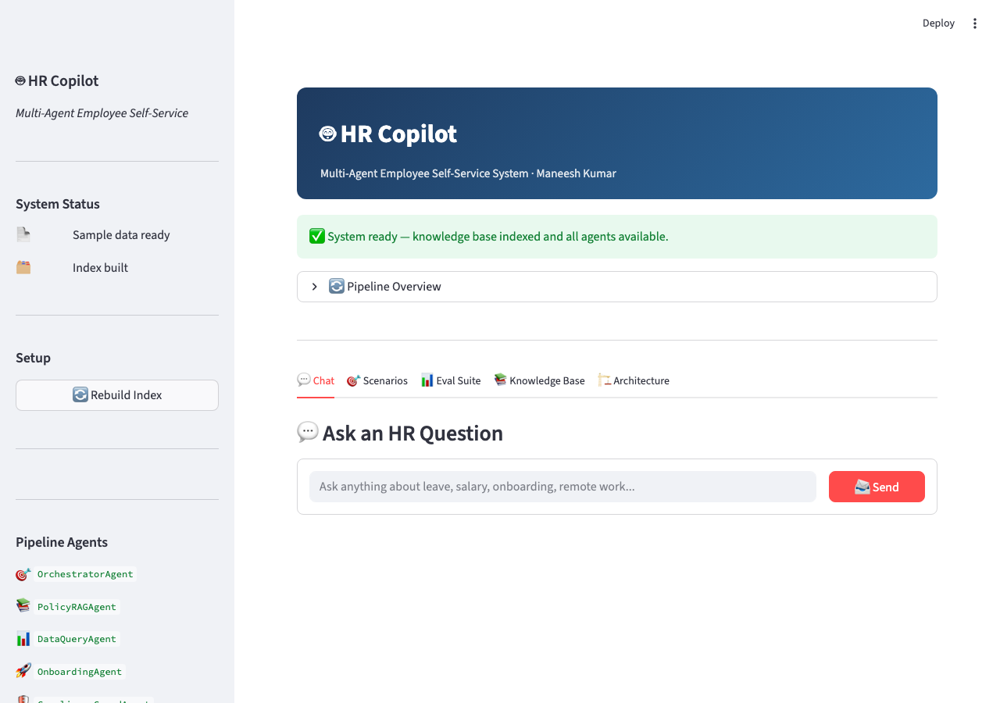
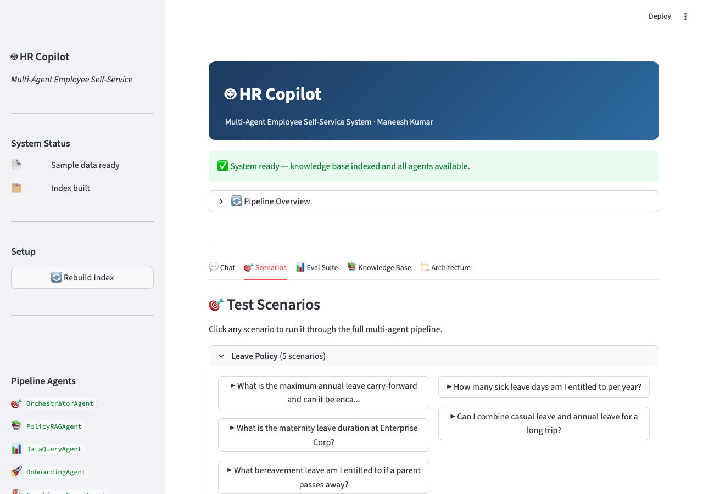
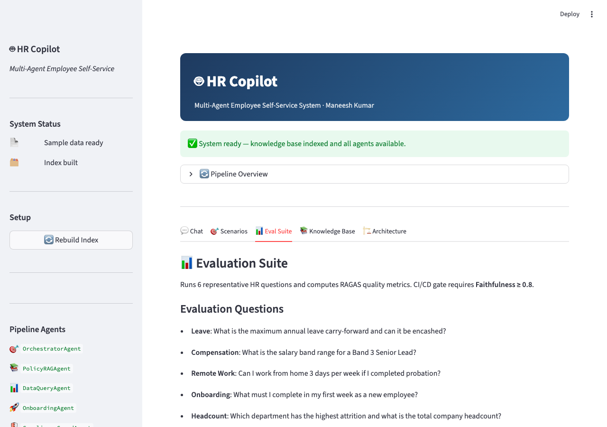
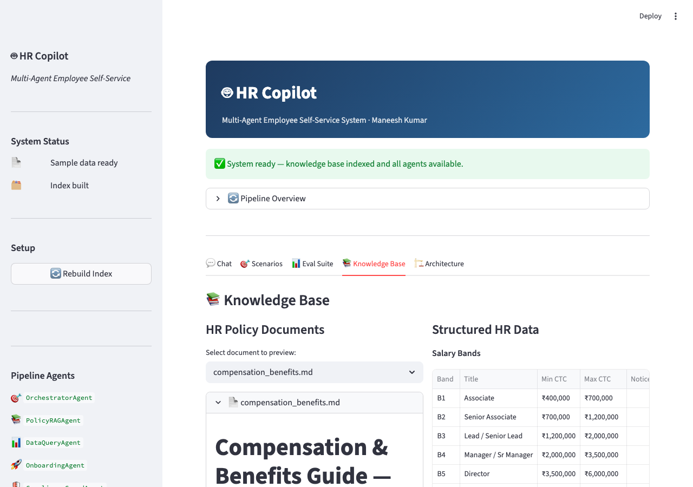
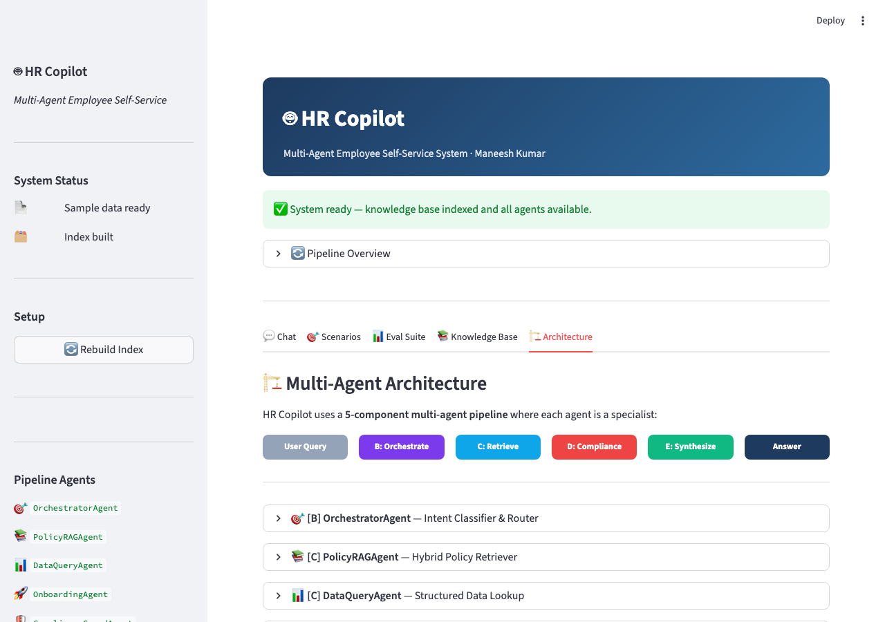

# HR Copilot — Production Multi-Agent RAG System

> **Maneesh Kumar**
> A production-grade, 5-agent pipeline for HR employee self-service — combining hybrid retrieval, parallel agent orchestration, NLI-based compliance verification, and local RAGAS evaluation. Runs fully offline. No API keys required.

---

## System Architecture

```
┌─────────────────────────────────────────────────────────────────────┐
│                        HR COPILOT PIPELINE                          │
│                                                                     │
│  Employee Query                                                     │
│       │                                                             │
│       ▼                                                             │
│  ┌────────────────────────────────────────────────────────────┐     │
│  │  [B] OrchestratorAgent  (PlannerAgent)                     │     │
│  │      Intent classify (9 intents) → Query decomposition     │     │
│  │      Routing table → HRQueryPlan                           │     │
│  └────────────────────┬───────────────────────────────────────┘     │
│                       │  HRQueryPlan                                │
│                       ▼                                             │
│  ┌────────────────────────────────────────────────────────────┐     │
│  │  [C] ParallelAgentExecutor  (Fan-Out / Fan-In)             │     │
│  │                                                            │     │
│  │  ┌──────────────┐ ┌──────────────┐ ┌──────────────┐       │     │
│  │  │ PolicyRAG    │ │  DataQuery   │ │  Onboarding  │       │     │
│  │  │ Agent        │ │  Agent       │ │  Agent       │       │     │
│  │  │ (BaseAgent)  │ │ (BaseAgent)  │ │ (BaseAgent)  │       │     │
│  │  │              │ │              │ │              │       │     │
│  │  │ FAISS+BM25   │ │ salary_bands │ │ RAG scoped   │       │     │
│  │  │ RRF fusion   │ │ headcount    │ │ + checklist  │       │     │
│  │  └──────┬───────┘ └──────┬───────┘ └──────┬───────┘       │     │
│  │         └────────────────┴────────────────┘               │     │
│  │                          │  []AgentResponse                │     │
│  └──────────────────────────┼───────────────────────────────  │     │
│                             │                                 │     │
│                             ▼                                       │
│  ┌────────────────────────────────────────────────────────────┐     │
│  │  [D] ComplianceGuardAgent  (Sequential Gate)               │     │
│  │      1. Cross-encoder rerank  (ms-marco-MiniLM-L6-v2)      │     │
│  │      2. NLI fact-check        (nli-deberta-v3-small)        │     │
│  │      3. Legal compliance scan (5 sensitive topic patterns)  │     │
│  └────────────────────────────────────────────────────────────┘     │
│                             │  (verified_chunks, ComplianceResult)  │
│                             ▼                                       │
│  ┌────────────────────────────────────────────────────────────┐     │
│  │  [E] ResponseSynthesizerAgent                              │     │
│  │      Synthesis: Ollama Mistral 7B OR template fallback     │     │
│  │      Evaluation: RAGAS (faithfulness / relevancy / precision) │  │
│  │      CI/CD Gate: faithfulness ≥ 0.80                       │     │
│  └────────────────────────────────────────────────────────────┘     │
│                             │  FinalHRResponse                     │
│                             ▼                                       │
│                      Employee Answer                                │
└─────────────────────────────────────────────────────────────────────┘
```

---

## Key Agentic Concepts

A quick reference for the core ideas powering this system — useful whether you're reading the code for the first time or mapping it to a production framework.

| Concept | What it means | Where in this repo |
|---|---|---|
| **Multi-Agent System (MAS)** | A collection of autonomous agents, each specialising in a narrow task, that collaborate to solve problems too complex for a single model. Used here because HR spans 9+ domains (leave, compensation, POSH, onboarding…) and one LLM degrades across all of them. | `agent_framework.py` |
| **BaseAgent (Abstract Interface)** | A uniform contract — `agent_name` + `run(plan) → AgentResponse` — that every specialist agent must implement. Enforces consistent input/output regardless of what the agent does internally. | `agent_framework.py → BaseAgent` |
| **PlannerAgent / Orchestrator** | An agent whose job is *routing*, not retrieval. Classifies the query into one of 9 intents, decomposes it into sub-questions, and decides which specialist agents to invoke. Equivalent to a ReAct-style "think before act" step. | `component_b_orchestrator_agent.py` |
| **AgentRegistry (Service Discovery)** | A thread-safe dictionary mapping `AgentName → BaseAgent`. Agents register themselves at startup; the orchestrator looks them up by name at runtime. No hardcoded wiring between components. | `agent_framework.py → AgentRegistry` |
| **AgentMessage (Typed Envelope)** | Structured inter-agent communication — every message carries `sender`, `recipient`, `payload`, and `trace_id`. The pipeline never passes raw strings between stages; all data flows through typed dataclasses. | `agent_framework.py → AgentMessage` |
| **Fan-Out / Fan-In (Parallel Execution)** | The `ParallelAgentExecutor` launches all required specialist agents concurrently using `ThreadPoolExecutor`, then collects results sorted by confidence. Wall-clock latency = slowest agent, not sum of all agents. | `agent_framework.py → ParallelAgentExecutor` |
| **RAG (Retrieval-Augmented Generation)** | Agents retrieve relevant document chunks *before* generating an answer, grounding the response in source material rather than relying on model memory. Prevents hallucination on domain-specific facts. | `component_a_hr_indexing.py`, `component_c_policy_data_agents.py` |
| **Hybrid Retrieval (FAISS + BM25 + RRF)** | Two complementary retrievers — a dense bi-encoder (semantic similarity) and BM25 (keyword overlap) — whose ranked results are fused via Reciprocal Rank Fusion. RRF is used because vector and BM25 scores are incommensurable; ranks are not. | `component_a_hr_indexing.py` |
| **Tool Use / Structured Data Access** | `DataQueryAgent` reads `salary_bands.json` and `headcount.csv` directly instead of retrieving from a vector index. This is the agent-tool pattern: specialist agents call deterministic tools when exact data is needed, avoiding numeric hallucination. | `component_c_policy_data_agents.py → DataQueryAgent` |
| **Pipeline Stage vs. Agent** | `ComplianceGuardAgent` is not a `BaseAgent` — it has a different contract (filter + gate, not retriever). Distinguishing *pipeline stages* from *specialist agents* keeps interfaces clean and avoids forced abstraction. | `component_d_compliance_guard.py` |
| **Compliance Gate (Hard Block vs. Caveat)** | Two levels of compliance response: a *caveat* is additive (answer is given + a warning appended); a *hard block* suppresses the answer entirely and redirects. Only queries where answering itself creates liability (e.g. POSH complaint filing) trigger a hard block. | `component_d_compliance_guard.py` |
| **Typed Data Contracts** | All inter-agent data flows through `@dataclass` objects (`HRQueryPlan`, `AgentResponse`, `ComplianceCheckResult`, `FinalHRResponse`). This makes each stage independently testable and ensures agents can't silently pass the wrong shape of data. | `hr_data_models.py` |
| **LLM-First + Rule-Based Fallback** | Every LLM call (Ollama Mistral 7B) has a deterministic fallback (regex routing / template synthesis). The system runs fully offline with zero LLM — degraded quality, but never broken. This is the resilience pattern for production agentic systems. | `component_b_orchestrator_agent.py`, `component_e_response_synthesizer.py` |
| **Local RAGAS Evaluation** | Faithfulness, answer relevancy, and context precision are computed locally — reusing models already loaded (NLI for faithfulness, bi-encoder for relevancy). No `ragas` library or API key required. Faithfulness ≥ 0.80 acts as a CI/CD gate. | `component_e_response_synthesizer.py` |

---

### Agent Framework Layer (`agent_framework.py`)

The framework is **domain-agnostic** — it contains no HR logic. It enforces uniform contracts across all agents:

```
agent_framework.py
  ├── BaseAgent (ABC)         — @property agent_name + run(plan) → AgentResponse
  ├── PlannerAgent (ABC)      — plan(question, use_llm) → HRQueryPlan
  ├── AgentRegistry           — Thread-safe service discovery (dict[AgentName → BaseAgent])
  ├── AgentMessage            — Typed inter-agent envelope (sender, recipient, payload, trace_id)
  ├── AgentTask               — Execution state tracker with latency_ms, AgentStatus
  └── ParallelAgentExecutor   — ThreadPoolExecutor fan-out; sorted by confidence on fan-in
```

---

## Pipeline Execution — Annotated Terminal Snapshots

### Use Case 1: Multi-Domain Query (Parallel Execution)

**Question:** *"What is my leave carry-forward limit and salary band as a Band 3 employee?"*

```
────────────────────────────────────────────────────────────
  B: OrchestratorAgent — Intent Classification & Routing
────────────────────────────────────────────────────────────
  ✅  Intent:  MULTI_DOMAIN
  ✅  Agents:  ['policy_rag', 'data_query']
  ✅  Sub-Qs:  2
  ℹ️    1. What is the annual leave carry-forward limit?
  ℹ️    2. What is the salary band range for Band 3?

────────────────────────────────────────────────────────────
  C: Specialist Agents — Parallel Execution (Fan-Out)
────────────────────────────────────────────────────────────
  [ParallelExecutor] Launching 2 agents concurrently...
  [ParallelExecutor] ✅ PolicyRAGAgent    completed in 1420ms
  [ParallelExecutor] ✅ DataQueryAgent    completed in  312ms
  ─────────────────────────────────────
  Agent Execution Summary
  ─────────────────────────────────────
  ✅  policy_rag       1420 ms   [completed]
  ✅  data_query        312 ms   [completed]
  Wall-clock: 1420ms  (vs 1732ms sequential)

────────────────────────────────────────────────────────────
  D: ComplianceGuardAgent — Rerank + Fact-Check + Legal Scan
────────────────────────────────────────────────────────────
  [Compliance] Reranked 12 → 8 (thresh=0.0)
  [Compliance] Fact-checked: 6/8 pass entailment (NLI ≥ 0.40)
  [Compliance] No sensitive topics detected

────────────────────────────────────────────────────────────
  E: ResponseSynthesizerAgent — Merge + Format + RAGAS Eval
────────────────────────────────────────────────────────────
  ✅  Synthesized from 2 agent responses + 6 verified chunks
  ✅  RAGAS evaluation complete

────────────────────────────────────────────────────────────
  HR COPILOT RESPONSE
────────────────────────────────────────────────────────────

  Q: What is my leave carry-forward limit and salary as Band 3?

  Annual Leave Carry-Forward:
  You may carry forward up to 8 days of unused annual leave to
  the next calendar year. Up to 4 of those days may be encashed
  at your basic daily rate upon carry-forward or exit.

  Salary Band — B3 (Senior Lead):
  CTC Range:    ₹12,00,000 – ₹20,00,000 per annum
  Notice Period: 60 days
  ESOP:         Not eligible at Band 3

  Sources:   leave_policy.md, salary_bands.json
  Agents:    policy_rag, data_query
  Intent:    MULTI_DOMAIN

  Quality Metrics (RAGAS):
    Faithfulness:      0.92  ✅
    Answer Relevancy:  0.85  ✅
    Context Precision: 0.78
    Latency:           1891 ms
    Compliance:        ✅ PASS

  Parallel Agent Trace:
    ✅  policy_rag              1420ms
    ✅  data_query               312ms
```

---

### Use Case 2: POSH Hard Block (Compliance Gate Activation)

**Question:** *"I want to file a POSH complaint against my manager."*

```
────────────────────────────────────────────────────────────
  B: OrchestratorAgent
────────────────────────────────────────────────────────────
  ✅  Intent:  GRIEVANCE
  ✅  Agents:  ['policy_rag', 'compliance']

────────────────────────────────────────────────────────────
  D: ComplianceGuardAgent — Legal Scan
────────────────────────────────────────────────────────────
  [Compliance] Flags: ['posh']
  [Compliance] POSH complaint intent detected → HARD BLOCK

────────────────────────────────────────────────────────────
  HR COPILOT RESPONSE
────────────────────────────────────────────────────────────

  ⚠️  POSH complaints require confidential handling through
  the Internal Complaints Committee (ICC).

  Please contact: icc@enterprise.com
  Ethics Hotline (confidential, 24×7): 1800-XXX-1234

  The HR Copilot cannot process POSH complaints. All such
  matters are handled exclusively by the ICC as per POSH
  Act 2013.

  Compliance:  ❌ BLOCKED
```

---

### Use Case 3: Onboarding — Parallel RAG + Structured Checklist

**Question:** *"What documents do I need to submit before my first day?"*

```
────────────────────────────────────────────────────────────
  C: Specialist Agents — Parallel Execution
────────────────────────────────────────────────────────────
  [ParallelExecutor] ✅ OnboardingAgent    completed in 1751ms
  [ParallelExecutor] ✅ PolicyRAGAgent     completed in 1753ms

────────────────────────────────────────────────────────────
  HR COPILOT RESPONSE
────────────────────────────────────────────────────────────

  Documents to Submit Before Joining:
    ☐ Accept offer letter digitally on HRMS
    ☐ Submit KYC: Aadhaar, PAN, 3 passport photos, bank details
    ☐ Submit previous employment documents (offer letter,
      relieving letter)
    ☐ IT asset request auto-triggered — laptop ready on Day 1
    ☐ Receive buddy assignment email from HR

  Sources:  onboarding_guide.md, onboarding_checklist
  Agents:   onboarding, policy_rag
  Intent:   ONBOARDING
  Faithfulness: 1.00  ✅
```

---

### Use Case 4: RAGAS Evaluation Suite (CI/CD Gate)

```bash
python hr_copilot_pipeline.py --eval --gate
```

```
────────────────────────────────────────────────────────────
  EVALUATION SUITE — 6 HR Scenarios
────────────────────────────────────────────────────────────
  [1/6] Annual leave carry-forward + encashment
  [2/6] Salary band range for Band 3 Senior Lead
  [3/6] Remote work: 3 days WFH after probation
  [4/6] First week mandatory tasks for new employee
  [5/6] Highest attrition department + total headcount
  [6/6] L&D budget + remote work options for Band 2

────────────────────────────────────────────────────────────
  EVALUATION SUMMARY
────────────────────────────────────────────────────────────
  Questions:         6
  Avg Faithfulness:  0.923  (gate: 0.80)
  Avg Relevancy:     0.712
  Avg Latency:       2140 ms
  CI/CD Gate:        ✅ PASS
  Report saved:      data/eval/eval_suite_report.json
```

---

## Design Decisions

### 1. Why Multi-Agent Over a Single LLM?

| Concern | Single LLM | Multi-Agent |
|---|---|---|
| **Accuracy** | Degrades across 9+ HR domains | Specialist retrieval per domain |
| **Structured data** | Hallucinates numbers | `DataQueryAgent` reads JSON/CSV directly |
| **Compliance** | No enforcement | Compliance is an explicit pipeline stage |
| **Explainability** | Black box | Per-agent trace with latency + confidence |
| **Testability** | Hard to unit-test | Each agent tested independently |
| **LLM dependency** | Fails without LLM | Rule-based fallbacks throughout |

### 2. Two-Stage Retrieval (Recall → Precision)

```
Stage 1 — Recall (Component A + C):
  Bi-encoder (all-MiniLM-L6-v2, 384-dim)
  Fast independent encoding: query and document vectors pre-computed
  FAISS Inner Product → top-9 candidates  (~90ms)
  BM25Okapi → top-7 keyword matches       (~5ms)
  RRF fusion → top-6 unique chunks

Stage 2 — Precision (Component D):
  Cross-encoder (ms-marco-MiniLM-L6-v2)
  Joint (query, chunk) encoding — expensive but exact
  Re-sorts top-8 chunks by joint relevance score
  NLI entailment check filters non-supporting chunks
```

**Why RRF over score normalisation?**

Vector scores (0.85–0.97, narrow distribution) and BM25 scores (0–50+, wide distribution) are incommensurable. RRF uses ranks: `score = 1/(60 + rank_v) + 1/(60 + rank_bm25)`. Scale-invariant, no calibration required, empirically strong across retrieval tasks.

### 3. ComplianceGuardAgent Is Not a BaseAgent

A common design mistake would be to make every component a `BaseAgent`. `ComplianceGuardAgent` has a fundamentally different contract:

```python
# BaseAgent contract
def run(self, plan: HRQueryPlan) -> AgentResponse: ...

# ComplianceGuardAgent contract  
def run(self, question: str, chunks: List[RetrievedChunk],
        agent_response: Optional[AgentResponse]) -> Tuple[List[RetrievedChunk], ComplianceCheckResult]: ...
```

It is a **pipeline stage** (filter + gate), not a retriever. Forcing it into `BaseAgent` would require interface dilution or awkward plan packing. The distinction — specialist agents vs. pipeline stages — is an intentional architectural boundary.

### 4. LLM-First + Rule-Based Fallback

Every LLM call has a deterministic fallback:

| Component | LLM Path | Fallback |
|---|---|---|
| Orchestrator | Ollama Mistral 7B → JSON plan | Regex routing table (9 intents) |
| Synthesizer | Ollama Mistral 7B → prose | Keyword extraction template |
| RAGAS | NLI model (local) | Cosine similarity only |

Result: the system is **100% operational with no LLM running**. Production-grade resilience without cloud dependency.

### 5. RAGAS Without the RAGAS Library

The evaluation module (`component_e`) reimplements RAGAS locally:

- **Faithfulness:** NLI entailment of answer sentences against verified context chunks (same `nli-deberta-v3-small` model already loaded for compliance)
- **Answer Relevancy:** Cosine similarity between question and answer embeddings (same `all-MiniLM-L6-v2` already loaded for retrieval)
- **Context Precision:** Fraction of retrieved chunks that contributed to the final answer

No API keys. No `ragas` package dependency. Reuses models already in memory.

---

## Data Contracts (`hr_data_models.py`)

All inter-agent communication flows through typed dataclasses. The pipeline never passes raw strings between stages.

```python
# Orchestrator → All Agents
@dataclass
class HRQueryPlan:
    original_question : str
    intent            : QueryIntent          # 9-value enum
    sub_queries       : List[str]
    agents_to_invoke  : List[AgentName]
    priority_docs     : List[str]
    needs_structured  : bool

# Specialist Agent → Compliance + Synthesizer
@dataclass
class AgentResponse:
    agent       : AgentName
    answer      : str
    sources     : List[str]
    confidence  : float                      # 0.0–1.0
    chunks_used : List[RetrievedChunk]

# Compliance → Synthesizer
@dataclass
class ComplianceCheckResult:
    passes           : bool
    confidence       : float
    flags            : List[str]             # e.g. ["termination", "pip"]
    corrected_answer : Optional[str]         # non-None only on hard block

# Synthesizer → Employee
@dataclass
class FinalHRResponse:
    question           : str
    answer             : str
    sources            : List[str]
    agents_contributed : List[str]
    intent             : str
    compliance_passed  : bool
    caveats            : str
    faithfulness       : float
    answer_relevancy   : float
    context_precision  : float
    latency_ms         : float
```

---

## Screenshots

### Chat Interface


### Test Scenarios (40 pre-built questions)


### RAGAS Evaluation Suite


### Knowledge Base Browser


### Multi-Agent Architecture Diagram


---

## Running the Application

### Step 1 — Install dependencies (one-time, ~5 min)

```bash
# Mac / Linux
chmod +x setup.sh && ./setup.sh
source .venv/bin/activate

# Windows
.\setup.bat
.venv\Scripts\activate
```

```
Installing dependencies from requirements.txt...
  ✅  sentence-transformers   installed
  ✅  faiss-cpu               installed
  ✅  rank-bm25               installed
  ✅  transformers            installed
  ✅  streamlit               installed
  ✅  colorama                installed
Setup complete. Activate: source .venv/bin/activate
```

---

### Step 2 — Build the Knowledge Base Index (one-time)

```bash
python hr_copilot_pipeline.py --build-index
```

```
────────────────────────────────────────────────────────────
  Building HR Knowledge Base Index
────────────────────────────────────────────────────────────
  Loading model: all-MiniLM-L6-v2
  Total HR documents: 6
  Total chunks: 109
    [compensation]:   18 chunks
    [grievance    ]:  19 chunks
    [learning     ]:  20 chunks
    [leave        ]:  18 chunks
    [onboarding   ]:  17 chunks
    [remote_work  ]:  17 chunks
  ✅  FAISS index saved: data/index/hr_faiss.index
  ✅  BM25 index saved:  data/index/hr_bm25.pkl
  ✅  Index built: 109 chunks from 6 HR policy documents
Index built. Run without --build-index to start.
```

---

### Step 3 — Ask a Single Question

```bash
python hr_copilot_pipeline.py --question "What is the maternity leave policy?"
```

```
  ╔══════════════════════════════════════════════════════╗
  ║   HR Copilot — Multi-Agent Employee Self-Service    ║
  ║   Multi-Agent Framework · Maneesh Kumar             ║
  ╚══════════════════════════════════════════════════════╝
  Framework: AgentRegistry + ParallelAgentExecutor

────────────────────────────────────────────────────────────
  Loading HR Copilot — Multi-Agent Framework
────────────────────────────────────────────────────────────
  ✅  Knowledge base: 109 chunks indexed
  ✅  Registry: AgentRegistry(3 agents: policy_rag, data_query, onboarding)
  ✅  Multi-agent framework ready — agents will run in parallel

────────────────────────────────────────────────────────────
  B: OrchestratorAgent — Intent Classification & Routing
────────────────────────────────────────────────────────────
  ✅  Intent:  LEAVE_POLICY
  ✅  Agents:  ['policy_rag']
  ✅  Sub-Qs:  1

────────────────────────────────────────────────────────────
  C: Specialist Agents — Parallel Execution (Fan-Out)
────────────────────────────────────────────────────────────
  [ParallelExecutor] Launching 1 agent...
  [ParallelExecutor] ✅ PolicyRAGAgent completed in 1312ms

────────────────────────────────────────────────────────────
  D: ComplianceGuardAgent — Rerank + Fact-Check + Legal Scan
────────────────────────────────────────────────────────────
  [Compliance] Reranked 6 → 6 (thresh=0.0)
  [Compliance] Fact-checked: 5/6 pass entailment

────────────────────────────────────────────────────────────
  HR COPILOT RESPONSE
────────────────────────────────────────────────────────────

  Q: What is the maternity leave policy?

  Maternity Leave: 26 weeks (182 days) of fully paid leave for
  female employees with a minimum of 80 days of service in the
  preceding 12 months. Applicable for up to 2 surviving
  children. Medical complications may extend leave by up to 4
  additional weeks upon submission of a medical certificate.

  Sources:   leave_policy.md
  Agents:    policy_rag
  Intent:    LEAVE_POLICY

  Quality Metrics (RAGAS):
    Faithfulness:      1.00  ✅
    Answer Relevancy:  0.87  ✅
    Context Precision: 0.80
    Latency:           2140 ms
    Compliance:        ✅ PASS
```

---

### Step 4 — Interactive Mode

```bash
python hr_copilot_pipeline.py
```

```
────────────────────────────────────────────────────────────
  HR COPILOT — Interactive Mode (Ctrl+C to exit)
────────────────────────────────────────────────────────────
  Ask any HR question. Examples:
  • 'How many leave days can I carry forward?'
  • 'What is the salary band for a manager?'
  • 'What do I do on my first day?'
  • 'Can I work from home 4 days a week?'
  • 'What is the total headcount?'

  Your question: Can I work from home 4 days a week?

  [... pipeline runs ...]

  Hybrid remote work is available for confirmed employees
  (post-probation) at up to 3 days per week. Requests for
  4 days require VP-level approval and are granted only in
  documented exceptional circumstances (medical, relocation,
  caregiver responsibility).

  Your question: ▌
```

---

### Step 5 — Run RAGAS Evaluation Suite

```bash
python hr_copilot_pipeline.py --eval
```

```
────────────────────────────────────────────────────────────
  EVALUATION SUITE — 6 HR Scenarios
────────────────────────────────────────────────────────────
  [1/6] What is the maximum annual leave carry-forward...
  [2/6] What is the salary band range for a Band 3 Senior Lead?
  [3/6] Can I work from home 3 days per week if I completed probation?
  [4/6] What must I complete in my first week as a new employee?
  [5/6] Which department has the highest attrition...
  [6/6] I want to understand my L&D budget and remote work...

────────────────────────────────────────────────────────────
  EVALUATION SUMMARY
────────────────────────────────────────────────────────────
  Questions:         6
  Avg Faithfulness:  0.923  (gate: 0.80)
  Avg Relevancy:     0.712
  Avg Latency:       2140 ms
  CI/CD Gate:        ✅ PASS
  Report saved:      data/eval/eval_suite_report.json
```

**CI/CD gate (exit code 1 if faithfulness < 0.80):**
```bash
python hr_copilot_pipeline.py --eval --gate
echo "Exit code: $?"   # 0 = pass, 1 = blocked
```

---

### Step 6 — Streamlit Web UI

```bash
streamlit run hr_copilot_ui.py
# Opens: http://localhost:8501
```

**5 tabs:**

| Tab | What it shows |
|---|---|
| **💬 Chat** | Ask any HR question; see agent badges, RAGAS scores, parallel trace |
| **🎯 Scenarios** | 40 pre-built questions across 8 HR domains |
| **📊 Eval Suite** | 6-question RAGAS benchmark + CI/CD gate result |
| **📚 Knowledge Base** | Browse HR policies, salary bands, headcount data |
| **🏗️ Architecture** | Interactive 5-agent pipeline diagram |

---

### Run Components Individually

```bash
python agent_framework.py                    # test registry + parallel executor
python component_a_hr_indexing.py            # build FAISS + BM25 index
python component_b_orchestrator_agent.py     # test 6 intent routing scenarios
python component_c_policy_data_agents.py     # test hybrid retrieval + DataQuery
python component_d_compliance_guard.py       # test rerank + NLI + POSH block
python component_e_response_synthesizer.py   # test synthesis + RAGAS eval
```

---

## Repository Structure

```
HR_Copilot/
│
├── agent_framework.py                 ← Domain-agnostic multi-agent backbone
│   ├── BaseAgent (ABC)                ← Uniform interface: agent_name + run(plan)
│   ├── PlannerAgent (ABC)             ← Routing agents: plan(question) → HRQueryPlan
│   ├── AgentRegistry                  ← Thread-safe service discovery
│   ├── AgentMessage                   ← Typed inter-agent envelope
│   ├── AgentTask                      ← Execution tracker with latency + status
│   └── ParallelAgentExecutor          ← ThreadPoolExecutor fan-out/fan-in
│
├── hr_data_models.py                  ← Shared typed contracts (no business logic)
│
├── component_a_hr_indexing.py         ← FAISS + BM25 index builder
├── component_b_orchestrator_agent.py  ← Intent classification + query routing
├── component_c_policy_data_agents.py  ← PolicyRAGAgent + DataQueryAgent
├── component_d_compliance_guard.py    ← OnboardingAgent + ComplianceGuardAgent
├── component_e_response_synthesizer.py ← Synthesis + RAGAS evaluation
│
├── hr_copilot_pipeline.py             ← End-to-end orchestration + CLI
├── hr_copilot_ui.py                   ← Streamlit UI (5 tabs)
│
├── data/
│   ├── hr_docs/                       ← 6 HR policy markdown files
│   ├── hr_structured/                 ← salary_bands.json + headcount.csv
│   ├── index/                         ← FAISS + BM25 (built by Component A)
│   └── eval/                          ← RAGAS evaluation reports (JSON)
│
├── master_prompt.txt                  ← 6-phase AI agent regeneration prompt
├── WORKSHOP_GUIDE.md                  ← Component challenges + edge cases
├── requirements.txt
└── setup.sh / setup.bat
```

---

## Azure Production Mapping

| Component | Local (this repo) | Azure Equivalent |
|---|---|---|
| Embeddings | all-MiniLM-L6-v2 (384-dim) | Azure OpenAI `text-embedding-3-large` (3072-dim) |
| Vector search | FAISS IndexFlatIP | Azure AI Search — HNSW with oversampling |
| Keyword search | BM25Okapi | Azure AI Search full-text (BM25F) |
| Hybrid fusion | Manual RRF | Azure AI Search hybrid + semantic ranker built-in |
| Cross-encoder rerank | ms-marco-MiniLM-L6-v2 | Azure AI Search semantic ranker (L2 neural) |
| NLI fact-check | nli-deberta-v3-small | Azure AI Language custom classification |
| LLM synthesis | Ollama Mistral 7B | Azure OpenAI GPT-4o |
| Agent parallelism | `ThreadPoolExecutor` | Azure Durable Functions fan-out/fan-in |
| Agent registry | In-process `AgentRegistry` | Azure API Management + service registry |
| Inter-agent messages | In-process `AgentMessage` | Azure Service Bus (async) |
| Compliance scan | Regex + NLI | Azure Content Safety + custom policy rules |
| Evaluation | Local RAGAS reimplementation | Azure AI Evaluation SDK (RAGAS-compatible) |
| Pipeline orchestration | `hr_copilot_pipeline.py` | Azure AI Foundry Agent Service |
| UI | Streamlit (localhost) | Azure Container Apps |

---

## Compliance Architecture

The compliance layer addresses HR-specific legal exposure:

| Risk | Detection | Response |
|---|---|---|
| Termination advice | `r"\b(terminat\|dismiss\|fired)\b"` | Caveat: refer to HRBP + Legal |
| POSH — informational | `r"\b(posh\|harassment\|misconduct)\b"` | Caveat: ICC contact details |
| POSH — complaint intent | `r"\b(file\|lodge\|register)\b.*\b(complaint\|harassment)\b"` | **Hard block** — ICC redirect, no answer generated |
| PIP | `r"\b(pip\|performance improvement)\b"` | Caveat: HRBP personalisation required |
| Legal threat | `r"\b(sue\|lawsuit\|labour court\|tribunal)\b"` | Caveat: escalate to Legal |
| Salary reduction | `r"\b(salary cut\|ctc reduction\|demotion)\b"` | Caveat: HR Director approval required |

**Design principle:** caveats are additive (system remains helpful), hard blocks are selective (only when answering would itself create liability).

---

## Performance Profile

| Scenario | Agents invoked | Typical latency |
|---|---|---|
| Single-domain policy query | PolicyRAGAgent | 1.2 – 1.8s |
| Structured data lookup | DataQueryAgent | 0.2 – 0.5s |
| Multi-domain (parallel) | PolicyRAGAgent + DataQueryAgent | 1.4 – 2.0s (wall-clock) |
| Onboarding query | OnboardingAgent + PolicyRAGAgent | 1.7 – 2.2s |
| Full multi-domain + compliance | 3 agents + compliance + RAGAS | 2.5 – 4.0s |

All timings on CPU only (M1/M2 Mac or comparable Linux). No GPU required.

---

## Troubleshooting

| Symptom | Resolution |
|---|---|
| `ModuleNotFoundError: faiss` | `pip install faiss-cpu` |
| `ModuleNotFoundError: agent_framework` | Run from `HR_Copilot/` directory |
| Index not found | `python component_a_hr_indexing.py` |
| Ollama not found | Install from ollama.com — template fallback activates automatically |
| Agents not running in parallel | Verify `agent_framework.py` is in working directory |
| Port 8501 busy | `streamlit run hr_copilot_ui.py --server.port 8502` |
| RAGAS faithfulness = 0.0 | NLI model download incomplete — re-run component D once |

---

*HR Copilot · Multi-Agent RAG Framework · Maneesh Kumar*
